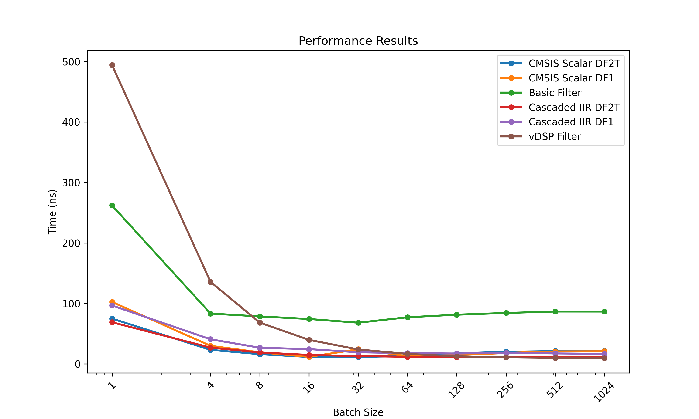
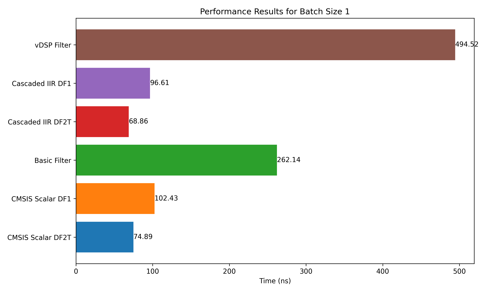
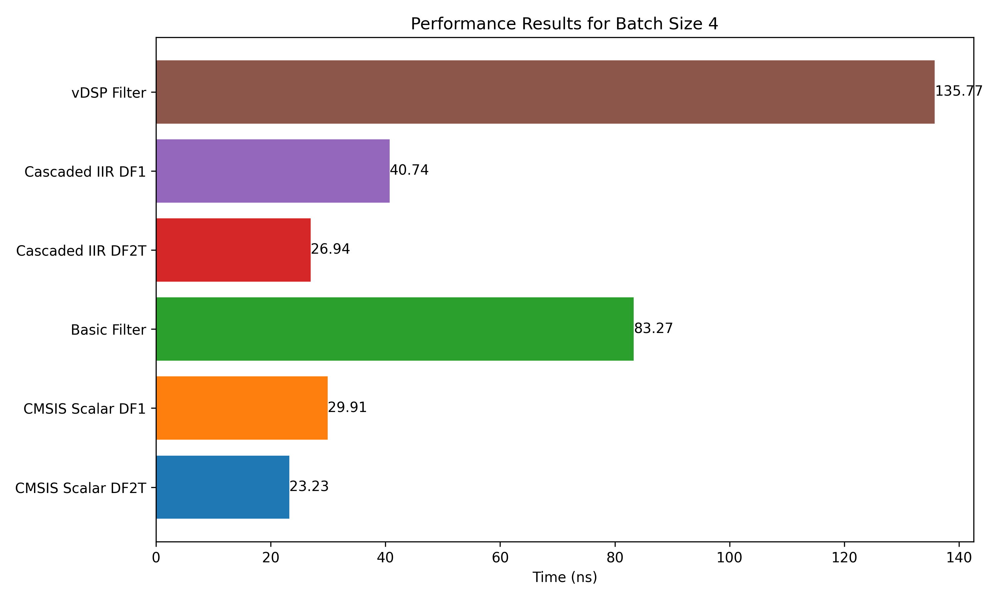
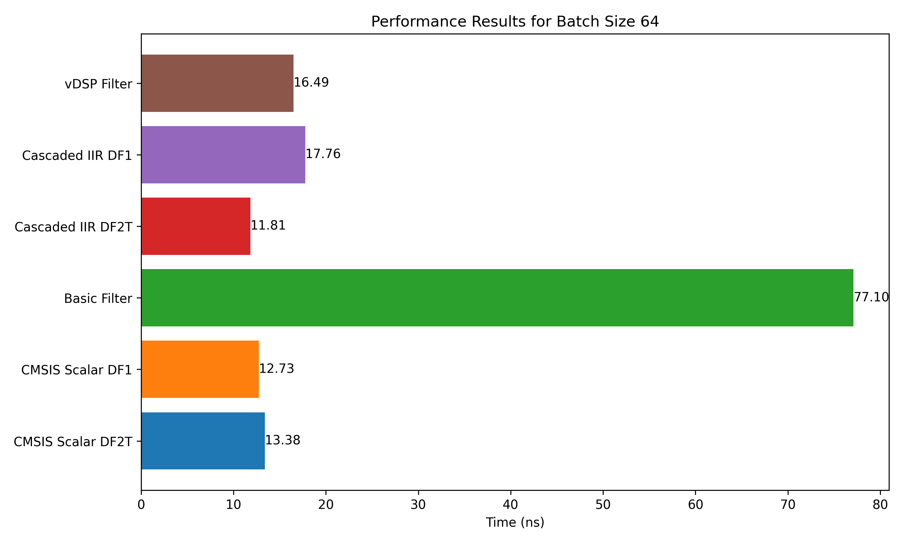
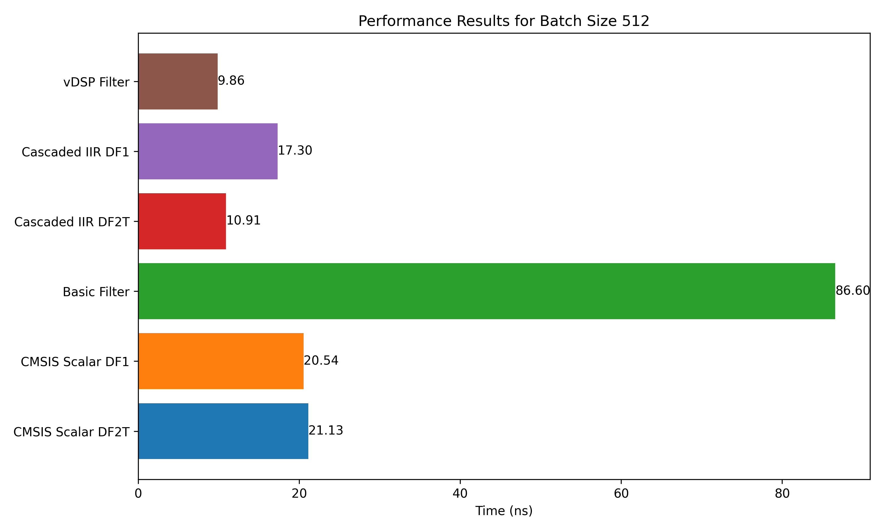

# Filter Benchmark

This repository contains benchmarks for different IIR filter implementations in C++.
The different implementations are:
- **CMSIS Scalar DF2T**: A scalar implementation of the Direct Form II Transposed (DF2T) structure using CMSIS DSP library.
- **CMSIS Scalar DF1** : A scalar implementation of the Direct Form I (DF1) structure using CMSIS DSP library.
- **Basic Filter** : A naive implementation of the Direct Form I (DF1) structure using C++.
- **Cascaded IIR DF2T** : A scalar implementation of the DF2T structure, but as opposed to the CMSIS implementation, each samples is processed by every stages before moving the next sample.
- **Cascaded IIR DF1** : A scalar implementation of the DF1 structure, but as opposed to the CMSIS implementation, each samples is processed by every stages before moving the next sample.
- **vDSP** : A vectorized implementation of the Direct Form I (DF1) structure using Apple's Accelerate framework.

## Results

The following results where obtained by running the benchmark on a 2024 Macbook Air with M3 chip. The benchmark measures the time taken to process 1 sample. The batch size indicates the number of samples processed in one go. The resulting time is the time taken to filter one batch of samples divided by the batch size. The test filter is a graphic equalizer composed of 11 cascaded biquads.

  
  

  
  

  

