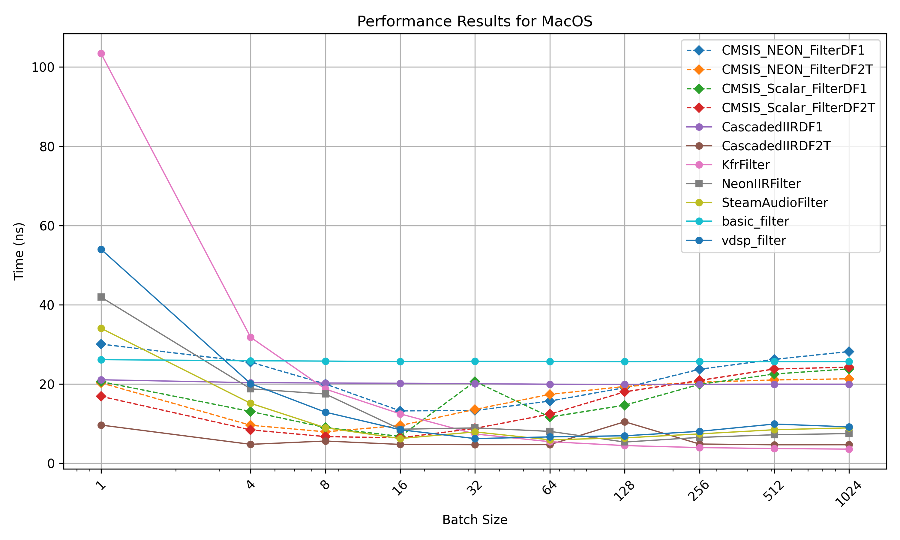
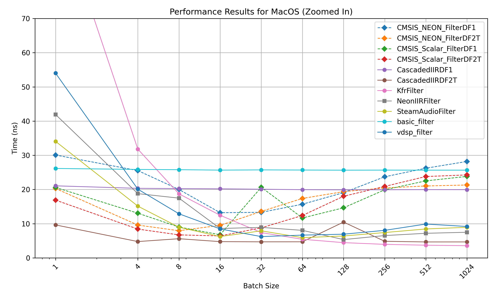
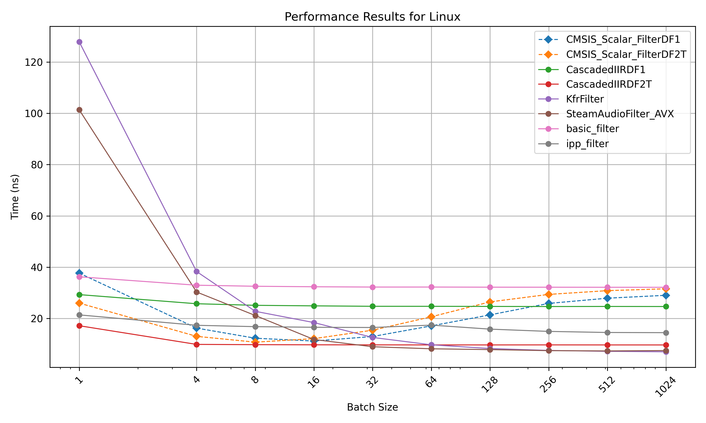
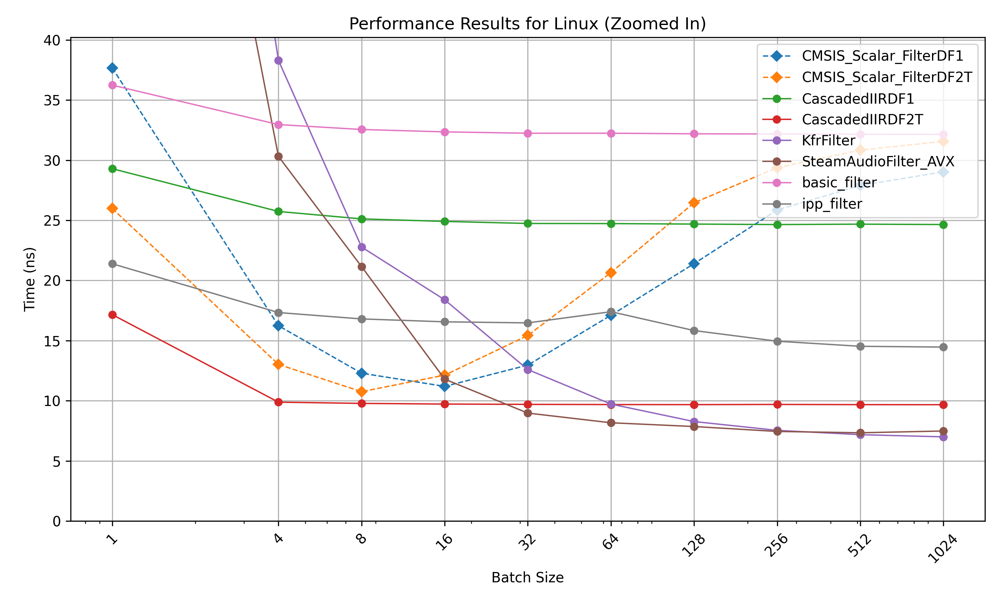
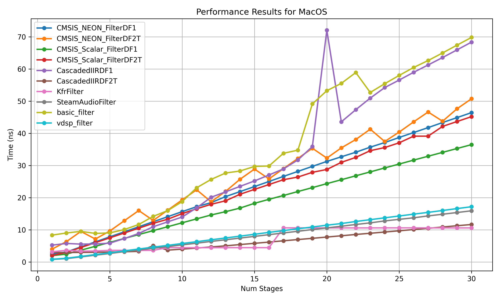
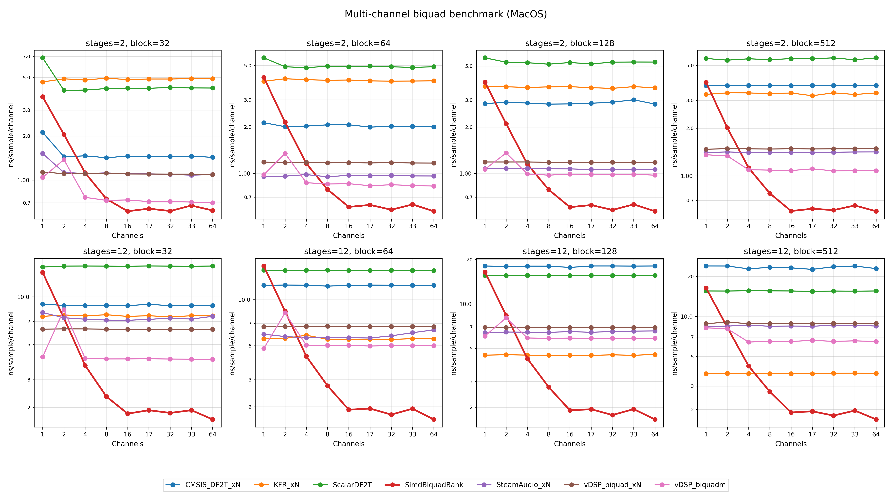
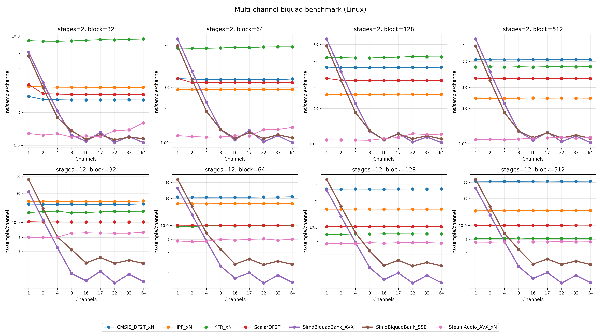

# Filter Benchmark

This repository contains benchmarks for different IIR filter implementations in C++.
The different implementations are:
- **CMSIS Scalar DF2T**: A scalar implementation of the Direct Form II Transposed (DF2T) structure using CMSIS DSP library.
- **CMSIS Scalar DF1** : A scalar implementation of the Direct Form I (DF1) structure using CMSIS DSP library.
- **Basic Filter** : A naive implementation of the Direct Form I (DF1) structure using C++.
- **Cascaded IIR DF2T** : A scalar implementation of the DF2T structure, but as opposed to the CMSIS implementation, each samples is processed by every stages before moving the next sample.
- **Cascaded IIR DF1** : A scalar implementation of the DF1 structure, but as opposed to the CMSIS implementation, each samples is processed by every stages before moving the next sample.
- **vDSP** : A vectorized implementation of the Direct Form I (DF1) structure using Apple's Accelerate framework.
- **IPP** : A vectorized implementation of the Direct Form II (DF2) structure using Intel's Integrated Performance Primitives (IPP) library (`ippsIIRInit_BiQuad_32f`).
- **SteamAudio** : A vectorized IIR filter from the [SteamAudio library](https://github.com/ValveSoftware/steam-audio). It reformulates the biquad recurrence so a whole block of outputs is computed from one coefficient matrix, and picks between a 4-wide and an 8-wide kernel at run time (`IPL_ENABLE_FLOAT8`, enabled on x86, dispatched on AVX support).

## Building

The CMSIS-DSP dependency is a git submodule, so it must be initialized first. `plot_results.py` expects the executables in `build/src/Release`, so use a multi-config generator:

```sh
git submodule update --init --recursive
cmake -S . -B build -G "Ninja Multi-Config" \
    -DCMAKE_C_COMPILER=clang -DCMAKE_CXX_COMPILER=clang++ \
    -DCMAKE_C_FLAGS="-march=native" -DCMAKE_CXX_FLAGS="-march=native"
cmake --build build --config Release -j
```

`-march=native` lets the x86 backends use SSE/AVX2/FMA. Intel IPP and Apple vDSP are detected automatically and their targets are skipped when unavailable. On x86 the SteamAudio filter is built with `IPL_ENABLE_FLOAT8`, which adds its 8-wide AVX kernel; the choice between that and the 4-wide kernel is made at run time from the CPU's reported SIMD level, so the binary still runs on pre-AVX hardware. Correctness is verified with `./build/src/Release/check` and `./build/src/Release/multichannel_check`.

## Methodology

The benchmarking test consists of filtering 32768 samples of white noise with a specific block size. The test filter is composed of 12 cascaded biquads.
```cpp
template <typename T>
void RunFilter(std::span<const float> input, std::span<float> output, size_t block_size)
{
    assert(input.size() % block_size == 0);
    T filter;
    size_t block_count = input.size() / block_size;
    for (size_t i = 0; i < block_count; ++i)
    {
        auto input_block = input.subspan(i * block_size, block_size);
        auto output_block = output.subspan(i * block_size, block_size);
        filter.process(input_block, output_block);
    }
}
```

The measurements are done using the [nanobench](https://nanobench.ankerl.com/) library.

## Results

### ARM (MacOS)

The following results where obtained by running the benchmark on a 2024 Macbook Air with M3 chip. The plots show the time taken to process 1 sample. The batch size indicates the number of samples processed by the filter at once. Compiled with Clang 21.0.0 with the `-O3` optimization flag.





### Intel (x86)

The following results where obtained by running the benchmark on an Intel i9-12900K CPU with the following specs:

|         |        |
|:-----------|:-----------|
| Core Speed | 4900 MHz |
| L1 Data | 8 x 48 KB + 8x32 KB|
| L1 Inst. | 8 x 23 KB + 8 x 64 KB|
| L2 Cache | 8 x 1.25 MB + 2 x 2 MB |
| L3 Cache | 30 MB |

Compiled with **Clang 22.1.8** using `-O3 -march=native` (AVX2 + FMA; this CPU has no AVX-512).






## Extra

I've also ran some benchmarks to see how the number of cascaded biquads in the filter affected performance. The results below were run on the macbook air with the M3 chip. The batch size is set to 128 and stays constant. The number of cascaded biquads varies from 1 to 31. 31 biquads is what you would typically find in a 1/3 octave filter bank. Y axis is the time taken to process 1 sample. The X axis is the number of cascaded biquads in the filter.

The results are mostly linear, as expected. One interesting thing to notice is that the CMSIS implementation of the DF2T filter using NEON instructions seem to be struggling if the number of cascaded biquads is not a multiple of 4. Adding dummy biquads to reach the next multiple of 4 might increase performance in some cases. This seems to be less of an issue for smaller block sizes.



## Multi-channel biquad bank

### What is being compared

The multi-channel benchmark compares a bank that vectorizes across channels (`SimdBiquadBank`, built once per SIMD width) against single-channel libraries instantiated N times (`ScalarDF2T`, `KFR_xN`, `CMSIS_DF2T_xN`, `SteamAudio_<kernel>_xN`, `IPP_xN`, `vDSP_biquad_xN`), plus `vDSP_biquadm`, which is the only other backend here that vectorizes across the channel dimension rather than filtering each channel independently.

Backends that have more than one kernel say which one produced the numbers. `SimdBiquadBank_SSE` / `SimdBiquadBank_AVX` are separate compilations, whereas SteamAudio picks its width at run time, so `SteamAudio_AVX_xN` reflects what `gSIMDLevel()` actually selected on the machine that produced the plot.

Results below were measured with `multichannel_perf` in a Release build. Run it as:
`cmake --build build --config Release --target multichannel_perf -j` and then `./build/src/Release/multichannel_perf`.

### Methodology

The coefficients are the same for every backend, but every channel gets a different filter section sequence. All setup and coefficient conversion happen in `prepare()`, outside the timed region. Filters are constructed once and reused across the block instead of being rebuilt per call. Channel data is presented deinterleaved (meaning each channel's samples are contiguous in memory).

Fresh results below are from a local run on this Apple M3 system with Apple clang 21.0.0, using `multichannel_perf`. The long-cascade case uses a 12-section cascade to match the single-channel benchmark's `kTestSOS`, so results from the two benchmarks can be compared directly.

### Results





### Licensing

KFR is GPL-2.0-or-later/commercial, so the benchmark binaries are GPL. SteamAudio is Apache-2.0 and is fetched at build time rather than redistributed here.