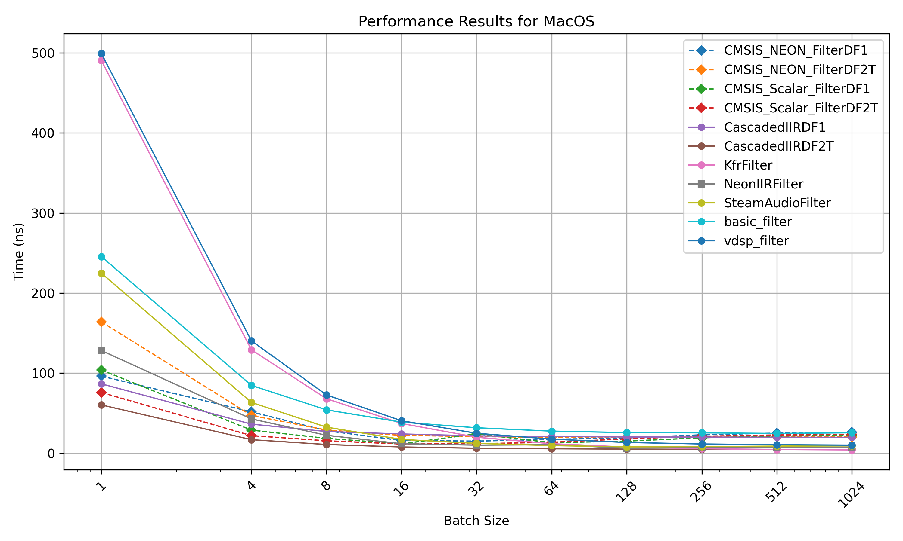

# Filter Benchmark

This repository contains benchmarks for different IIR filter implementations in C++.
The different implementations are:
- **CMSIS Scalar DF2T**: A scalar implementation of the Direct Form II Transposed (DF2T) structure using CMSIS DSP library.
- **CMSIS Scalar DF1** : A scalar implementation of the Direct Form I (DF1) structure using CMSIS DSP library.
- **Basic Filter** : A naive implementation of the Direct Form I (DF1) structure using C++.
- **Cascaded IIR DF2T** : A scalar implementation of the DF2T structure, but as opposed to the CMSIS implementation, each samples is processed by every stages before moving the next sample.
- **Cascaded IIR DF1** : A scalar implementation of the DF1 structure, but as opposed to the CMSIS implementation, each samples is processed by every stages before moving the next sample.
- **vDSP** : A vectorized implementation of the Direct Form I (DF1) structure using Apple's Accelerate framework.

## Methodology

The benchmarking test consists of filtering 32768 samples of white noise with a specific block size. The test filter is a graphic equalizer composed of 11 cascaded biquads.
```cpp
template <typename T>
void RunFilter(std::span<const float> input, std::span<float> output, size_t block_size)
{
    assert(input.size() % block_size == 0);
    T filter;
    size_t block_count = input.size() / block_size;
    for (size_t i = 0; i < block_count; ++i)
    {
        auto input_block = input.subspan(i * block_size, block_size);
        auto output_block = output.subspan(i * block_size, block_size);
        filter.process(input_block, output_block);
    }
}
```

The measurement are done using the [nanobench](https://nanobench.ankerl.com/) library.

## Results

### MacOS

The following results where obtained by running the benchmark on a 2024 Macbook Air with M3 chip. The plots show the time taken to process 1 sample. The batch size indicates the number of samples processed by the filter at once. Compiled with **AppleClang 17.0.0.17000013** with the `-O3` optimization flag.



